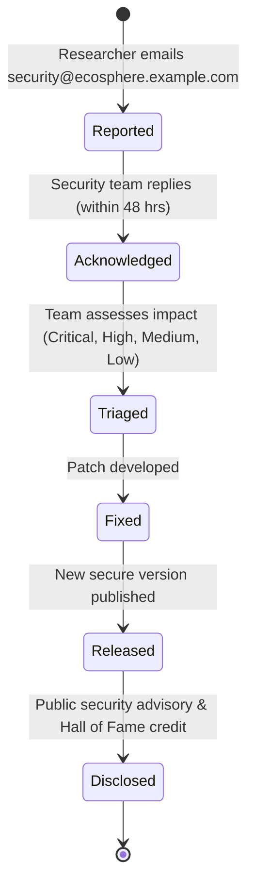

# Security Policy

## Supported Versions

Only the latest stable release receives security patches. Older versions are not supported and should be upgraded immediately.

| Version | Supported |
| ------- | --------- |
| 1.0.x   | ✅        |
| < 1.0   | ❌        |

## Reporting a Vulnerability

We take the security of our users and the EcoSphere platform seriously. If you believe you have found a security vulnerability, please **do not** open a public issue. Instead, follow the responsible disclosure process below:

### Disclosure Process

1. **Report** — Email your findings to `security@ecosphere.example.com` with the subject `[Security] <brief-description>`. Include:
   - A clear description of the vulnerability
   - Steps to reproduce (minimal, self-contained)
   - Proof of concept (if applicable)
   - Your suggested impact assessment

2. **Acknowledgment** — We will acknowledge receipt within **48 hours** and begin triage.

3. **Assessment** — Our security team will validate and categorize the issue (Critical, High, Medium, Low). We may reach out for clarification.

4. **Resolution** — We aim to issue a fix within:
   - **Critical**: 48 hours
   - **High**: 5 business days
   - **Medium/Low**: Next release cycle

5. **Disclosure** — Once fixed, we will publish a security advisory and (with your permission) credit you as the discoverer in our Hall of Fame.

## Vulnerability Disclosure Workflow

## Dependency Management

Dependencies are audited regularly via Dependabot and `npm audit`. Known vulnerabilities are tracked and patched in the next release. For critical CVEs, hotfixes are released outside the normal schedule.

---

_This policy is maintained by the EcoSphere security team. Last updated: 2026-08-05._
