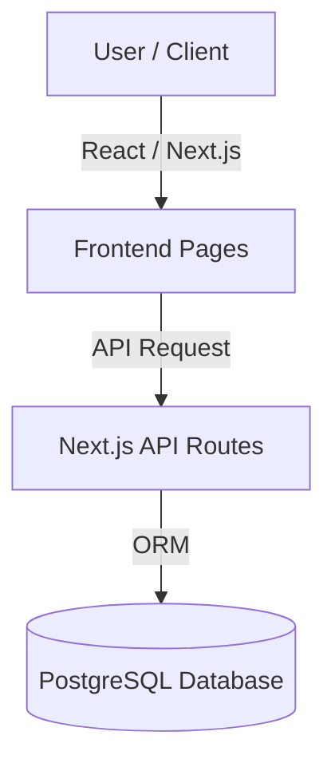

# EcoSphere Developer Guide

Welcome to the EcoSphere developer guide! This document provides technical insights into building, extending, and maintaining the Supply-Chain Carbon Intelligence Platform.

## System Architecture

EcoSphere is a Next.js application designed to calculate and analyze supply chain greenhouse gas (GHG) footprints. It integrates client-side data handling with a relational PostgreSQL database.



## Running the Project Locally

### Prerequisites

- Node.js (version >= 18.18.0)
- npm or yarn
- Local PostgreSQL instance or a serverless Neon database instance

### Initial Setup

1. Clone the repository and install dependencies:

   ```bash
   npm install
   ```

2. Seed the database with standard emission factors:

   ```bash
   npm run db:push
   ```

3. Start the hot-reloading development server:
   ```bash
   npm run dev
   ```

## Contribution Workflow

We enforce clean branch isolation and modular pull requests:

- Base your changes on the latest `dev` branch.
- Avoid large monolithic pull requests; focus on one problem per branch.
- Keep test coverage updated.
