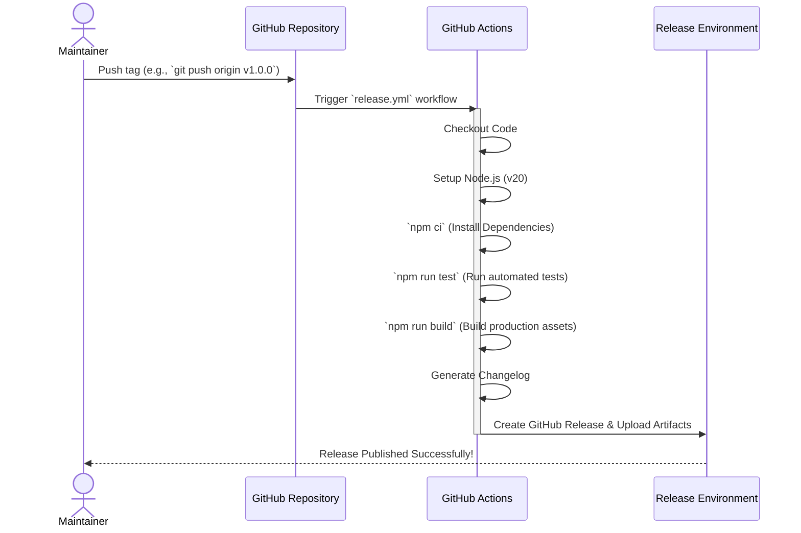

# Release Workflow Documentation

This document describes the automated release process for EcoSphere, managed via GitHub Actions.

## Overview

To streamline deployments, reduce human error, and ensure consistent artifacts, we use a fully automated release pipeline. Whenever a maintainer pushes a new version tag (e.g., `v1.0.0`), GitHub Actions will automatically take over the build, testing, and release process.

## Pipeline Architecture

The automated release workflow follows this sequence:



## How to Trigger a Release

To trigger a new automated release, follow these steps from your local machine:

1. **Commit your changes**: Ensure all your work is committed and merged into the `main` branch.
2. **Tag the commit**: Create an annotated tag following Semantic Versioning (SemVer) with a `v` prefix.
   ```bash
   git tag -a v1.0.0 -m "Release version 1.0.0"
   ```
3. **Push the tag to origin**: Push the tag to GitHub.
   ```bash
   git push origin v1.0.0
   ```

Once pushed, the [GitHub Actions Release Workflow](../.github/workflows/release.yml) will automatically begin.

## Expected Outcomes

- A new official release is published on the GitHub Releases page.
- A dynamically generated changelog detailing the commits since the last tag is included in the release notes.
- Compiled artifacts (from `dist/` or `build/` directories) are automatically attached to the release for easy downloading.

## Troubleshooting

If the release fails:

1. Navigate to the **Actions** tab in the GitHub repository.
2. Click on the failed **Build and Release** job.
3. Review the logs to identify whether the failure occurred during the `npm run test` or `npm run build` steps.
4. Fix the issue, push the fix, delete the old tag remotely (`git push origin --delete v1.0.0`), and push the tag again.
